---
# Feel free to add content and custom Front Matter to this file.
# To modify the layout, see https://jekyllrb.com/docs/themes/#overriding-theme-defaults

layout: default  
---

## **MadDE-NDA:** Collision-Free Time-Optimal Planning of Underwater Gliders in Time-Varying Currents via Adaptive **N**iching **D**ual-**A**rchive Differential Evolution

This project presents a state-of-the-art GPU-accelerated 4D path planning framework designed for **Autonomous Underwater Gliders (AUGs)** operating in complex, time-varying ocean environments. To overcome the curse of dimensionality and the spatiotemporal causal chain in long-range missions, we propose a fixed-dimensional **B-spline trajectory encoding** combined with a novel evolutionary optimizer, **MadDE-NDA** (Niching Dual-Archive Differential Evolution). By leveraging massive **GPU parallelism**, the framework rigorously evaluates dynamic feasibility and continuous-domain collision safety in seconds.

### Key Features 

*   **📉 Fixed-Dimensional B-Spline Encoding:** Transforms the traditional variable-length, profile-wise routing problem into a compact, fixed-dimensional search space using B-spline control points in a local coordinate system, significantly improving optimization efficiency for long-endurance missions.
*   **🧬 Adaptive Niching Dual-Archive Evolution (MadDE-NDA):** Introduces dual cooperative archives for quality retention and diversity preservation, coupled with a stagnation-triggered niching scheme. This prevents premature convergence and robustly explores highly multimodal route corridors induced by complex terrain and currents.
*   **🛡️ Strict Continuous 3D Obstacle Avoidance:** Utilizes a Euclidean Signed Distance Field (ESDF) combined with adaptive **Sphere Tracing** (Ray Marching). This completely eliminates the "tunneling effect" of traditional discrete sampling, ensuring absolute safety against high-resolution **GEBCO seabed topography**. 
*   **🚀 GPU-Accelerated 4D Dynamic Verification:** Employs parallel 4th-order Runge-Kutta (RK4) integration on the GPU to strictly evaluate time-varying kinematics using **4D CMEMS ocean data**. The population-level parallel architecture reduces evaluation time by orders of magnitude (up to 18.6× speedup), making time-optimal planning computationally tractable.

### Visual Results

[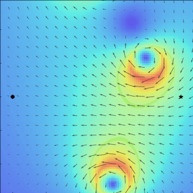](examples#3vor)
[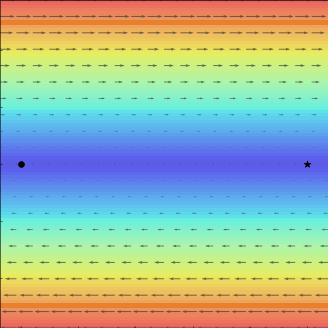](examples#linear)
[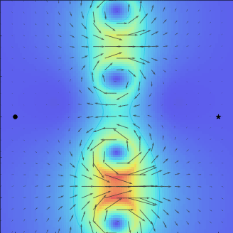](examples#4vor)

[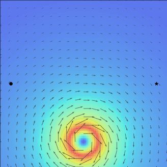](examples#movor)
[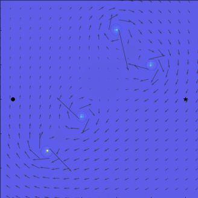](examples#movors)
[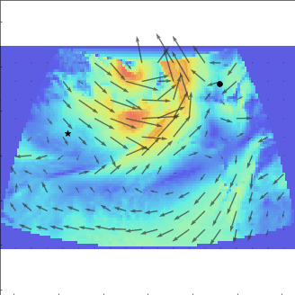](examples#sanjuan-dublin-ortho-tv)

[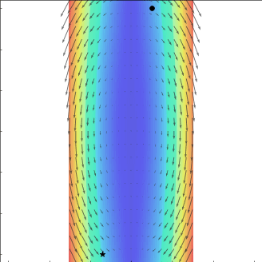](examples#chertovskih2020)
[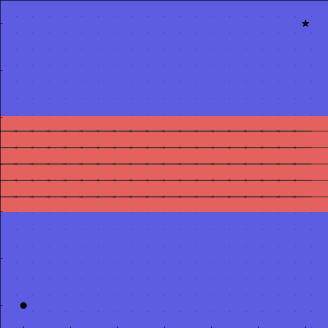](examples#band)
[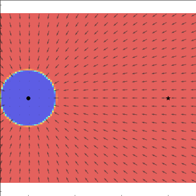](examples#trap)

[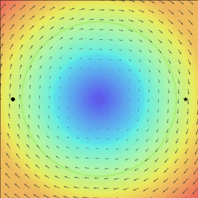](examples#big_rankine)
[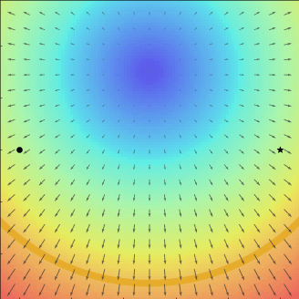](examples#pointsym-techy2011)
[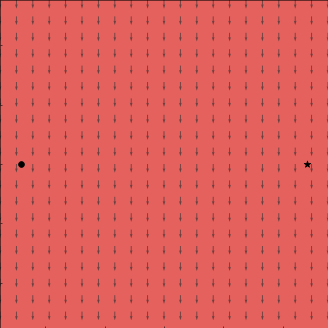](examples#lva)

### BibTeX

If you find our work helpful, please consider citing it:

```Latex
@article{li2024collision,
      title={Collision-Free Time-Optimal Planning of Underwater Gliders in Time-Varying Currents via Adaptive Niching Dual-Archive Differential Evolution}, 
      author={Li, Zezhong and Juan, Rongshun and Li, Yang and Liu, Shoufu and Wang, Tianshu and Shi, Shuaikun and Du, Leihao and Feng, Wanjun and Gao, Zhongke},
      journal={Under Review at Ocean Engineering},
      year={2026}
}
```
