<style>
  .wrapper {
    max-width: 1300px !important; 
    padding-right: 20px;
    padding-left: 20px;
  }
</style>


## **MadDE-NDA：** 面向时变洋流环境的水下滑翔机无碰撞时间最优路径规划：自适应**小生境**双**档案**差分进化方法

本项目提出了一种面向复杂时变海洋环境中**自主水下滑翔机（Autonomous Underwater Gliders, AUGs）**的 GPU 加速 4D 路径规划框架。针对长航程任务中存在的维数灾难和时空因果链问题，本文采用固定维度的 **B-spline 轨迹编码**，并设计了一种新的进化优化器 **MadDE-NDA**（Niching Dual-Archive Differential Evolution）。借助大规模 **GPU 并行计算**，该框架能够在较短时间内严格评估轨迹的动力学可达性和连续空间避碰安全性。

### 核心特点 

*   **📉 固定维度 B-spline 编码：** 在局部坐标系中利用 B-spline 控制点表示水下滑翔机水平路径，将传统变长度、剖面级航向序列规划问题转化为紧凑的固定维度搜索问题，从而显著提升长航程任务中的优化效率。
*   **🧬 自适应小生境双档案进化优化（MadDE-NDA）：** 引入用于质量保持和多样性维持的双协同档案，并结合停滞触发的小生境选择机制，抑制种群早熟收敛，使算法能够在复杂地形和时变洋流诱导的多模态航路走廊中进行更稳健的搜索。
*   **🛡️ 严格连续三维避障：** 构建欧氏符号距离场（Euclidean Signed Distance Field, ESDF），并结合自适应 **Sphere Tracing**（Ray Marching）进行连续域碰撞检测。该方法能够避免传统离散采样中的“隧穿效应”，从而在高分辨率 **GEBCO 海底地形**约束下提供更可靠的安全保障。 
*   **🚀 GPU 加速 4D 动力学验证：** 在 GPU 上并行执行四阶 Runge-Kutta（RK4）积分，并结合 **CMEMS 4D 海洋环境数据**严格评估时变洋流下的运动学可行性。种群级并行评估架构可显著降低计算开销，最高可获得约 18.6× 的加速效果，使时间最优路径规划具备实际可计算性。


<!-- ========================================================= -->
<!-- 新增项目介绍部分：研究动机、方法流程、优化器设计与实验验证。 -->
<!-- ========================================================= -->
<!-- ========================================================= -->

<style>
  .story-grid {
    display: grid;
    grid-template-columns: repeat(auto-fit, minmax(260px, 1fr));
    gap: 18px;
    margin: 22px 0 32px 0;
  }
  .story-card {
    border: 1px solid rgba(128,128,128,0.22);
    border-radius: 12px;
    padding: 18px 20px;
    box-shadow: 0 4px 14px rgba(0,0,0,0.08);
    background: rgba(255,255,255,0.02);
  }
  .story-card h4 {
    margin-top: 0;
    margin-bottom: 8px;
  }
  .figure-box {
    margin: 20px auto 32px auto;
    text-align: center;
    width: 100%;
    max-width: 820px;
  }
  .figure-box img {
    display: block;
    width: 100%;
    height: auto;
    max-width: 100%;
    border-radius: 10px;
    box-shadow: 0 5px 16px rgba(0,0,0,0.16);
    border: 1px solid rgba(128,128,128,0.20);
  }
  .figure-wide {
    max-width: 960px;
  }
  .figure-medium {
    max-width: 740px;
  }
  .figure-compact {
    max-width: 660px;
  }
  .figure-bspline {
    max-width: 640px;
  }
  .figure-caption {
    margin: 8px auto 0 auto;
    max-width: 92%;
    color: #666;
    font-size: 0.88rem;
    line-height: 1.42;
  }
  @media (max-width: 768px) {
    .figure-box,
    .figure-wide,
    .figure-medium,
    .figure-compact,
    .figure-bspline {
      max-width: 100%;
    }
  }
  .pipeline-step {
    font-weight: 600;
    padding: 3px 8px;
    border-radius: 6px;
    background: rgba(0, 86, 179, 0.09);
    white-space: nowrap;
  }
</style>

### 研究动机

本工作的核心目标是使**长航程水下滑翔机路径规划**同时具备**紧凑表示**、**物理可执行性**、**碰撞安全性**和**计算可处理性**。与短距离几何路径规划不同，真实水下滑翔机任务本质上是一个 4D 规划问题：平台在三维空间中运动，同时洋流环境随时间变化。因此，最终生成的航路不仅需要较短或较平滑，还必须能够在洋流扰动下实现可达，并且相对于真实海底地形保持安全。

<div class="story-grid">
  <div class="story-card">
    <h4>1. 从变长度剖面序列到固定维度搜索</h4>
    <p>传统剖面级航向编码直接优化一串航向指令。在长航程任务中，不同候选航路所需的滑翔剖面数量可能不同，导致决策向量长度不一致，使标准 DE 算子难以直接使用。MadDE-NDA 则改为优化固定数量的 B-spline 横向偏移量。</p>
  </div>
  <div class="story-card">
    <h4>2. 从几何曲线到可执行滑翔机运动</h4>
    <p>B-spline 航路通过弦长采样被解码为与滑翔周期一致的航点序列。每个路径段对应一个下潜—上浮周期，因此优化得到的几何曲线能够映射回水下滑翔机的实际运动模式。</p>
  </div>
  <div class="story-card">
    <h4>3. 从离散障碍检测到连续安全验证</h4>
    <p>固定步长碰撞检测可能漏检采样点之间的地形侵入。本文基于 GEBCO 海底地形构建 ESDF，并利用 sphere tracing 对连续三维轨迹与海底地形之间的关系进行自适应检测。</p>
  </div>
  <div class="story-card">
    <h4>4. 从通用 DE 到航路走廊感知进化</h4>
    <p>时变洋流与海底地貌可能形成多个相互竞争的可行航路走廊。MadDE-NDA 在 MadDE 基础上引入质量/多样性档案与停滞触发小生境机制，使种群既能开发优良搜索盆地，又能从较差航路走廊中跳出。</p>
  </div>
</div>

<div class="figure-box figure-wide">
  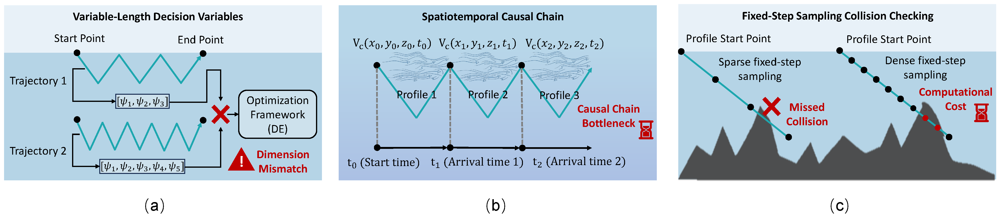
  <div class="figure-caption">
     基于 DE 的长航程水下滑翔机 4D 路径规划面临的主要挑战，包括变长度决策变量、时空因果耦合，以及稀疏固定步长碰撞检测可能导致的漏检问题。
  </div>
</div>

### 端到端框架

该框架可以理解为一个闭环的“优化—验证”流程：

<p style="line-height: 2.1;">
  <span class="pipeline-step">GEBCO 海底地形</span> +
  <span class="pipeline-step">CMEMS 洋流数据</span> →
  <span class="pipeline-step">ESDF 构建</span> →
  <span class="pipeline-step">B-spline 编码</span> →
  <span class="pipeline-step">弦长航点解码</span> →
  <span class="pipeline-step">RK4 动力学验证</span> →
  <span class="pipeline-step">ESDF sphere tracing</span> →
  <span class="pipeline-step">GPU 适应度评估</span> →
  <span class="pipeline-step">MadDE-NDA 优化</span> →
  <span class="pipeline-step">无碰撞时间最优航路</span>
</p>

在每一代迭代中，候选决策向量定义 B-spline 控制点的偏移量。这些偏移量首先被解码为水平航点，再重构为三维下潜—上浮剖面。随后，GPU 后端对整个种群并行评估航行时间、可达性以及碰撞惩罚。得到的适应度值进一步指导 MadDE-NDA 更新种群、档案、变异策略概率以及档案源采样概率。

### 问题定义

给定起点、终点、预设下潜深度、固定俯仰角、真实海底地形以及时变洋流场，规划器需要搜索一条满足以下三类约束、且总航行时间最短的航路：

* **终端可达性：** 水下滑翔机在执行一系列下潜—上浮周期后，应能够抵达目标区域。
* **动力学可行性：** 对每个路径段而言，滑翔机的水平速度必须能够补偿横向洋流分量，并保持期望的地面航迹方向。
* **碰撞安全性：** 重构得到的三维轨迹必须保持在海底障碍区域之外，并满足预设安全裕度。

该问题比普通二维最短路径规划更加复杂，因为一条航路的质量取决于每个路径段的到达时间、该时刻遇到的局部洋流，以及完整三维剖面上的地形间隙。

### B-Spline 轨迹编码

MadDE-NDA 并不直接优化数百个航向指令，而是在与起点—终点连线方向对齐的局部坐标系中，使用三次 B-spline 曲线表示水平航路。中间控制点的纵向坐标沿起终点连线固定，仅优化其横向偏移量。该设计具有两个实际优势：

* 即使在长航程任务中，决策维度也能保持固定且较小。
* 生成的轨迹能够自然地从起点区域向目标区域推进，减少不必要的回绕和绕行。

优化完成后，连续 B-spline 曲线通过弦长采样被解码为航点序列。弦长间隔根据单个下潜—上浮周期对应的水平航程确定，从而将优化得到的几何路径与水下滑翔机可执行的剖面级运动联系起来。

<div class="figure-box figure-bspline">
  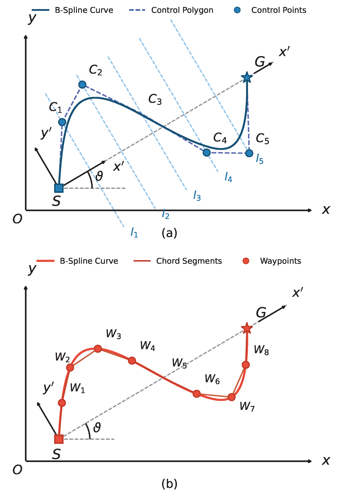
  <div class="figure-caption">
    基于 B-spline 的轨迹表示。子图（a）展示固定起终点和可优化的横向控制点偏移；子图（b）展示用于下潜—上浮执行的弦长航点解码过程。
  </div>
</div>

### 动力学可行性验证

由于洋流随时间变化，轨迹评估本质上具有序贯性。一个滑翔剖面的到达时间和终端位置会决定下一个剖面所遇到的洋流场。因此，MadDE-NDA 通过前向数值仿真验证每条候选航路，而不是将各路径段简单地视为相互独立的几何边。

对于每个解码后的路径段，规划器在局部洋流场下执行基于 RK4 的前向积分。在每个积分步中，系统都会检查横向洋流分量是否超过滑翔机的水平速度补偿能力。若滑翔机无法补偿横向洋流并维持期望方向，则该路径段会被判定为不可行并施加惩罚。这样可以保证最终航路不仅在几何上有效，而且在时变洋流作用下具备物理可执行性。

<div class="figure-box figure-compact">
  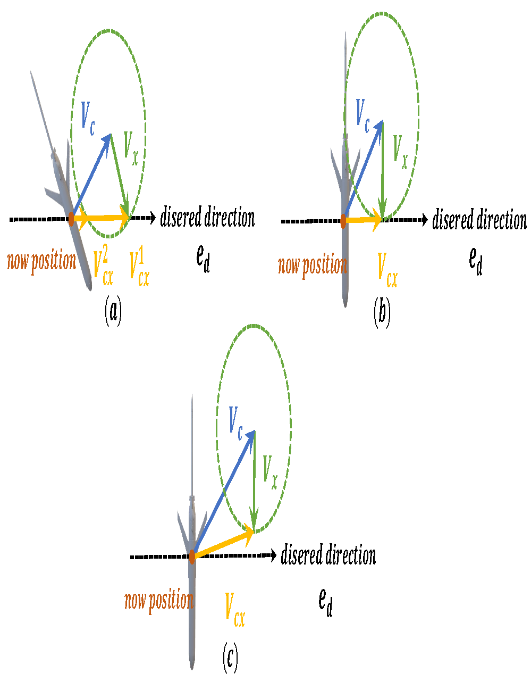
  <div class="figure-caption">
    洋流作用下的几何可达性分析，包括可行、边界可行和不可行三种情形，其判定取决于横向洋流分量的大小。
  </div>
</div>

### 连续域碰撞检测

为提高复杂海底地形条件下的航行安全性，规划器基于 GEBCO 海底地形数据构建三维欧氏符号距离场（ESDF）。ESDF 可提供符号距离查询：正值表示自由空间，负值表示轨迹侵入海底区域。基于该表示方法，本文采用球面追踪方法对重构锯齿形轨迹中的每个下潜/上浮航段进行碰撞检测。

与固定步长采样相比，sphere tracing 会根据当前位置到障碍物的距离自适应调整检测步长：在开阔水域可以采用较大步长快速前进，而在接近海底结构时会自动变得保守。这一机制为高频种群级碰撞检测提供了更好的安全性—效率平衡。

<div class="figure-box figure-wide">
  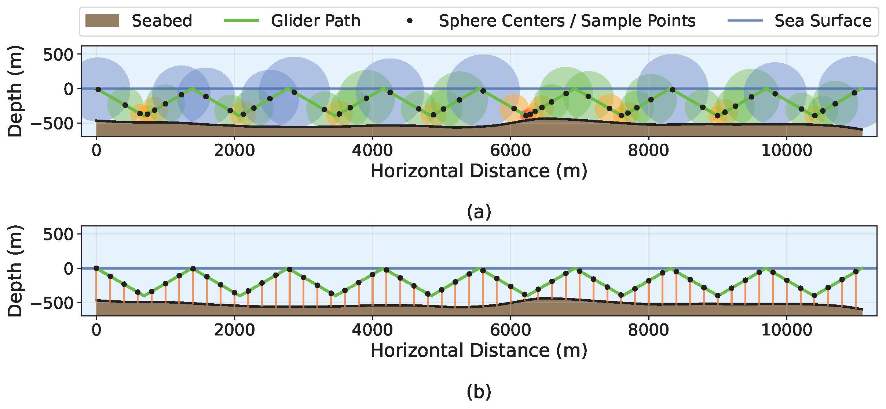
  <div class="figure-caption">
    基于 ESDF 的 sphere tracing 与固定步长采样的对比。图中应突出：稀疏均匀采样可能跳过碰撞区域，而 sphere tracing 可基于符号距离自适应调整步长。
  </div>
</div>

### MadDE-NDA 优化器

MadDE-NDA 是在原始 MadDE 框架基础上进一步开发的。其动机在于，水下滑翔机航路规划往往具有明显多模态特征：环境中可能同时存在多个可行航路走廊，而种群可能过早收敛到局部可行但全局较差的走廊。为此，MadDE-NDA 引入了面向航路规划的若干机制：

<div class="story-grid">
  <div class="story-card">
    <h4>质量档案</h4>
    <p>质量档案用于保存历史上具有竞争力、但被替换的父代个体。它为档案辅助变异提供潜在优良搜索方向，并增强算法对高质量航路盆地的开发能力。</p>
  </div>
  <div class="story-card">
    <h4>多样性档案</h4>
    <p>多样性档案根据新颖度和质量选择性保存被拒绝的子代个体。它相当于一个多样性导向的候选库，可向变异过程注入替代性结构信息。</p>
  </div>
  <div class="story-card">
    <h4>停滞触发小生境</h4>
    <p>当最优适应度连续若干代停滞时，算法进入逃逸阶段。精英个体仍采用贪婪选择，而非精英子代则与邻近的非精英父代进行基于拥挤度的替换竞争。</p>
  </div>
  <div class="story-card">
    <h4>自适应来源采样</h4>
    <p>算法会根据历史适应度改进情况，动态更新从当前种群、质量档案或多样性档案中采样的概率，使优化器能够在进化过程中自适应调节开发与探索之间的平衡。</p>
  </div>
</div>

### GPU 加速的种群级评估

该规划器中计算开销最大的部分是适应度评估：每条候选航路都需要被重构、进行动力学积分、检查可达性，并验证碰撞安全性。为使这一过程具备可计算性，框架将评估阶段卸载到 GPU 上执行。CPU 负责进化操作和种群更新，GPU 则并行执行批量 RK4 积分与基于 ESDF 的 sphere tracing。

该设计非常适合进化规划：尽管单个候选解内部的剖面序列具有时间耦合关系，但在种群层面，各候选解可以相互独立地并行评估。实际运行中，GPU 后端显著降低了重复适应度评估的墙钟时间，使长航程 4D 水下滑翔机路径规划更加实用。

<div class="figure-box figure-wide">
  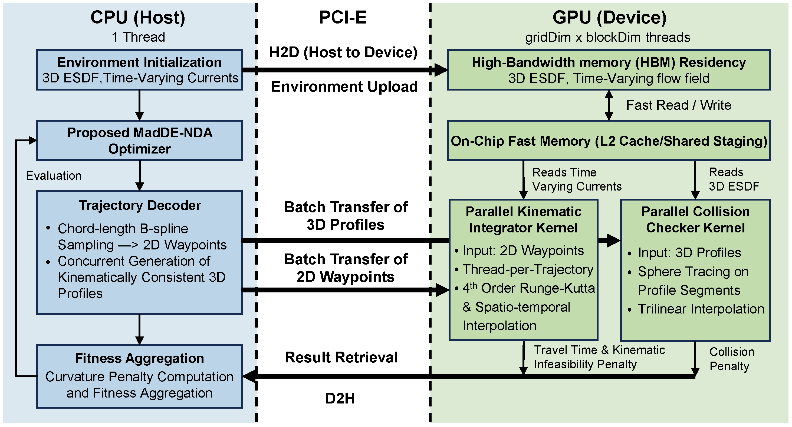
  <div class="figure-caption">
    CPU-GPU 分工示意。CPU 运行 DE 主循环并传输解码后的轨迹描述信息；GPU 在并行评估后返回航行时间、可行性标志和碰撞惩罚。
  </div>
</div>

### 实验验证

实验设计旨在回答四个实际问题：**规划器能否找到可行航路？MadDE-NDA 是否能够改进 MadDE 基线？生成的航路是否具有物理合理性？GPU/ESDF 实现是否足以支持重复种群评估？**

#### 仿真案例

本文基于南海北部及菲律宾海邻近海域的 GEBCO 海底地形数据和 CMEMS 洋流数据，构建了五个真实海域规划案例。这些案例覆盖了不同的任务距离、下潜深度、安全裕度以及地形—洋流条件。

| 案例 | 下潜深度 | 安全裕度 | 起点 → 终点 | 洋流时间窗口 |
|:---:|:---:|:---:|:---|:---|
| 1 | 1000 m | 50 m | `[120.90, 20.60]` → `[121.60, 21.40]` | 2025-11-21 to 2025-12-11 |
| 2 | 550 m | 15 m | `[111.65, 16.10]` → `[112.40, 16.70]` | 2025-11-21 to 2025-12-11 |
| 3 | 1500 m | 50 m | `[122.38, 22.00]` → `[128.30, 24.40]` | 2025-11-11 to 2025-12-11 |
| 4 | 1000 m | 25 m | `[114.70, 16.65]` → `[110.80, 17.50]` | 2025-11-21 to 2025-12-11 |
| 5 | 550 m | 25 m | `[110.20, 14.10]` → `[110.80, 17.20]` | 2025-11-21 to 2025-12-11 |

<div class="figure-box figure-wide">
  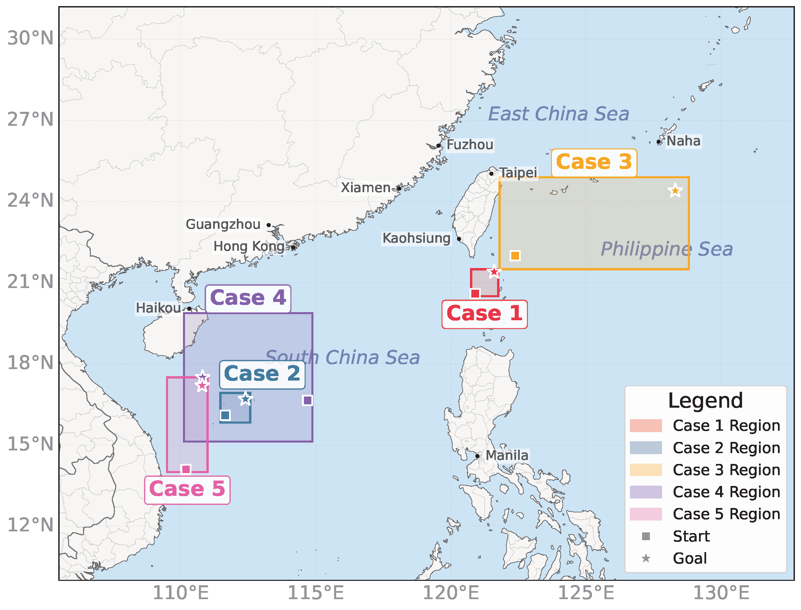
  <div class="figure-caption">
   五个规划区域的地理概览，其中方形标记表示起点，星形标记表示终点。
  </div>
</div>

#### 对比算法与评价指标

本文将 MadDE-NDA 与六种代表性 DE 变体进行比较：**JADE**、**L-SHADE**、**SaDE**、**IMODE**、**MadDE** 和 **NL-SHADE-LBC**。所有方法均采用相同的 B-spline 决策表示、搜索边界以及 GPU 适应度评估后端。每种算法在每个案例上独立运行 **31 次**，统一适应度评价预算为 **25,000 次**。

对比实验报告了四类指标：

* **成功率：** 在给定约束下，算法是否能够生成到达目标区域的可行航路。
* **适应度：** 综合优化目标，包括航行时间和约束惩罚。
* **航行时间：** 面向任务执行的物理目标，以小时计。
* **运行时间：** 在相同评估后端下完成优化所需的墙钟时间。

#### 主要定量结果

* **稳健可行性：** MadDE-NDA 在五个案例中均取得 `1.0` 的成功率，包括若干对比方法成功率下降的困难案例 5。
* **整体适应度优势：** MadDE-NDA 在五个案例中的四个取得最佳平均适应度。唯一例外是案例 3，但所提出的 NDA 机制仍然显著改进了原始 MadDE 基线。
* **统计排名：** 在全部 `5 × 31 = 155` 组匹配实验中，MadDE-NDA 获得最佳 Friedman 平均排名（`2.9710`）。在 Bonferroni-Dunn 事后检验下，其显著优于 JADE、L-SHADE、SaDE、IMODE 和 NL-SHADE-LBC。
* **相对于 MadDE 的时间最优优势：** 针对航行时间的补充配对 Wilcoxon 符号秩检验给出 `p = 7.58 × 10^-9`。在 `155` 组匹配实验中，MadDE-NDA 有 `105` 组获得比 MadDE 更短的航行时间，支持所提出小生境双档案设计在核心时间最优目标上的优势。
* **稳定航路质量：** 在代表性可视化结果中，MadDE-NDA 倾向于生成更平滑、曲折程度更低的航路，同时保持清晰的地形安全间隙。

<div class="figure-box figure-wide">
  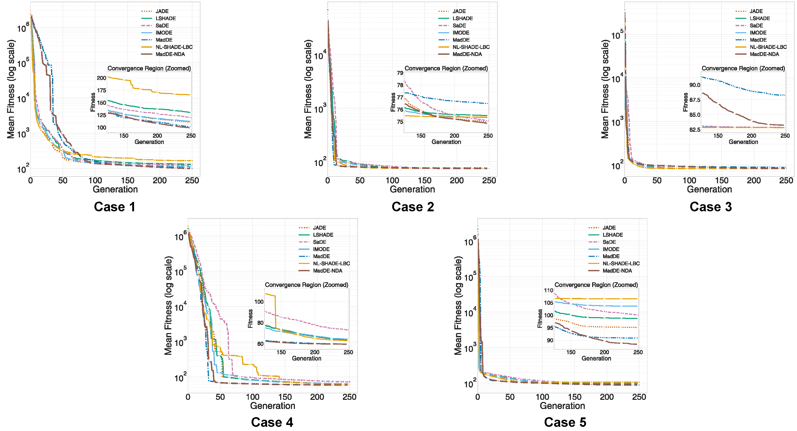
  <div class="figure-caption">
    不同算法在五个仿真案例上的平均适应度对比。
  </div>
</div>

<div class="figure-box figure-medium">
  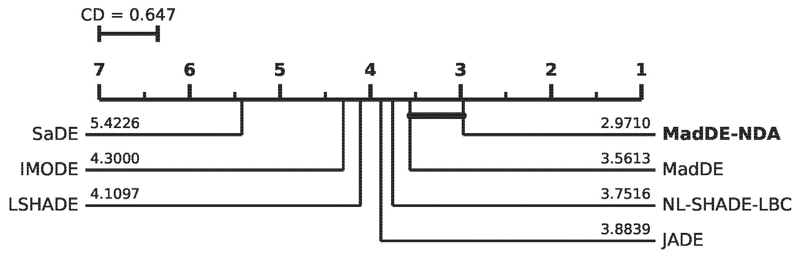
  <div class="figure-caption">
    临界差异图，展示各 DE 变体在 155 组匹配实验中的平均排名。
  </div>
</div>

#### 物理轨迹可视化

三维轨迹结果表明，优化得到的航路并非仅仅是抽象二维曲线，而是可以在真实海底地形表面上重构为重复的下潜—上浮剖面。在五个案例中，轨迹均保持无碰撞，并与高起伏海底结构保持清晰安全间隔，说明该框架能够将轨迹平滑性、洋流感知可达性和地形安全性统一到同一规划结果中。

<div class="figure-box figure-wide">
  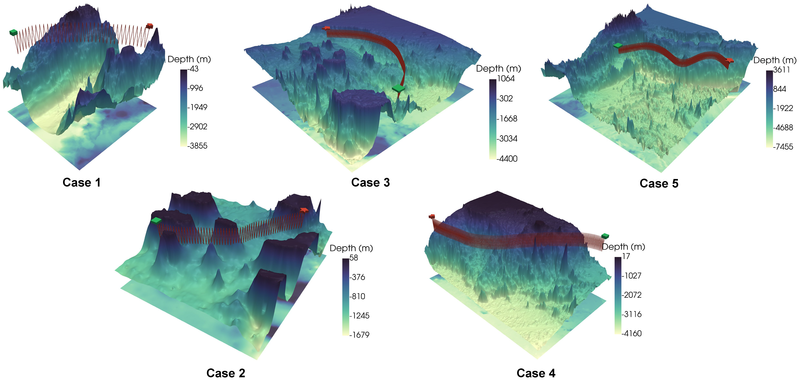
  <div class="figure-caption">
    代表性中位适应度 MadDE-NDA 轨迹在对应 GEBCO 海底地形上的三维可视化结果。
  </div>
</div>

### 可视化结果

<div style="display: flex; flex-direction: column; gap: 50px; align-items: center; margin-bottom: 50px; margin-top: 20px; width: 100%;">

  <!-- ================= Case 1 ================= -->
  <div style="display: flex; flex-wrap: wrap; justify-content: space-between; gap: 20px; width: 100%;">
    <!-- Case 1: 2D -->
    <div style="flex: 1 1 48%; min-width: 350px; position: relative;">
      <div style="position: absolute; bottom: 15px; left: 15px; background-color: #0056b3; color: white; padding: 6px 12px; font-size: 0.9rem; font-weight: bold; z-index: 5; border-radius: 4px; box-shadow: 0 2px 4px rgba(0,0,0,0.3); letter-spacing: 0.5px;">
        案例 1（二维视图）
      </div>
      <video width="100%" autoplay loop muted playsinline controls style="border-radius: 8px; box-shadow: 0 5px 15px rgba(0,0,0,0.2); display: block; border: 1px solid rgba(128,128,128, 0.2); height: auto; background-color: transparent;">
        <source src="assets/video/case_1.mp4" type="video/mp4">
      </video>
    </div>
    <!-- Case 1: 3D -->
    <div style="flex: 1 1 48%; min-width: 350px; position: relative;">
      <div style="position: absolute; bottom: 15px; left: 15px; background-color: #28a745; color: white; padding: 6px 12px; font-size: 0.9rem; font-weight: bold; z-index: 5; border-radius: 4px; box-shadow: 0 2px 4px rgba(0,0,0,0.3); letter-spacing: 0.5px;">
        案例 1（三维视图）
      </div>
      <video width="100%" autoplay loop muted playsinline controls style="border-radius: 8px; box-shadow: 0 5px 15px rgba(0,0,0,0.2); display: block; border: 1px solid rgba(128,128,128, 0.2); height: auto; background-color: transparent;">
        <source src="assets/video/case_1_3D.mp4" type="video/mp4">
      </video>
    </div>
  </div>

  <!-- ================= Case 2 ================= -->
  <div style="display: flex; flex-wrap: wrap; justify-content: space-between; gap: 20px; width: 100%;">
    <!-- Case 2: 2D -->
    <div style="flex: 1 1 48%; min-width: 350px; position: relative;">
      <div style="position: absolute; bottom: 15px; left: 15px; background-color: #0056b3; color: white; padding: 6px 12px; font-size: 0.9rem; font-weight: bold; z-index: 5; border-radius: 4px; box-shadow: 0 2px 4px rgba(0,0,0,0.3); letter-spacing: 0.5px;">
        案例 2（二维视图）
      </div>
      <video width="100%" autoplay loop muted playsinline controls style="border-radius: 8px; box-shadow: 0 5px 15px rgba(0,0,0,0.2); display: block; border: 1px solid rgba(128,128,128, 0.2); height: auto; background-color: transparent;">
        <source src="assets/video/case_2.mp4" type="video/mp4">
      </video>
    </div>
    <!-- Case 2: 3D -->
    <div style="flex: 1 1 48%; min-width: 350px; position: relative;">
      <div style="position: absolute; bottom: 15px; left: 15px; background-color: #28a745; color: white; padding: 6px 12px; font-size: 0.9rem; font-weight: bold; z-index: 5; border-radius: 4px; box-shadow: 0 2px 4px rgba(0,0,0,0.3); letter-spacing: 0.5px;">
        案例 2（三维视图）
      </div>
      <video width="100%" autoplay loop muted playsinline controls style="border-radius: 8px; box-shadow: 0 5px 15px rgba(0,0,0,0.2); display: block; border: 1px solid rgba(128,128,128, 0.2); height: auto; background-color: transparent;">
        <source src="assets/video/case_2_3D.mp4" type="video/mp4">
      </video>
    </div>
  </div>

  <!-- ================= Case 3 ================= -->
  <div style="display: flex; flex-wrap: wrap; justify-content: space-between; gap: 20px; width: 100%;">
    <!-- Case 3: 2D -->
    <div style="flex: 1 1 48%; min-width: 350px; position: relative;">
      <div style="position: absolute; bottom: 15px; left: 15px; background-color: #0056b3; color: white; padding: 6px 12px; font-size: 0.9rem; font-weight: bold; z-index: 5; border-radius: 4px; box-shadow: 0 2px 4px rgba(0,0,0,0.3); letter-spacing: 0.5px;">
        案例 3（二维视图）
      </div>
      <video width="100%" autoplay loop muted playsinline controls style="border-radius: 8px; box-shadow: 0 5px 15px rgba(0,0,0,0.2); display: block; border: 1px solid rgba(128,128,128, 0.2); height: auto; background-color: transparent;">
        <source src="assets/video/case_3.mp4" type="video/mp4">
      </video>
    </div>
    <!-- Case 3: 3D -->
    <div style="flex: 1 1 48%; min-width: 350px; position: relative;">
      <div style="position: absolute; bottom: 15px; left: 15px; background-color: #28a745; color: white; padding: 6px 12px; font-size: 0.9rem; font-weight: bold; z-index: 5; border-radius: 4px; box-shadow: 0 2px 4px rgba(0,0,0,0.3); letter-spacing: 0.5px;">
        案例 3（三维视图）
      </div>
      <video width="100%" autoplay loop muted playsinline controls style="border-radius: 8px; box-shadow: 0 5px 15px rgba(0,0,0,0.2); display: block; border: 1px solid rgba(128,128,128, 0.2); height: auto; background-color: transparent;">
        <source src="assets/video/case_3_3D.mp4" type="video/mp4">
      </video>
    </div>
  </div>

  <!-- ================= Case 4 ================= -->
  <div style="display: flex; flex-wrap: wrap; justify-content: space-between; gap: 20px; width: 100%;">
    <!-- Case 4: 2D -->
    <div style="flex: 1 1 48%; min-width: 350px; position: relative;">
      <div style="position: absolute; bottom: 15px; left: 15px; background-color: #0056b3; color: white; padding: 6px 12px; font-size: 0.9rem; font-weight: bold; z-index: 5; border-radius: 4px; box-shadow: 0 2px 4px rgba(0,0,0,0.3); letter-spacing: 0.5px;">
        案例 4（二维视图）
      </div>
      <video width="100%" autoplay loop muted playsinline controls style="border-radius: 8px; box-shadow: 0 5px 15px rgba(0,0,0,0.2); display: block; border: 1px solid rgba(128,128,128, 0.2); height: auto; background-color: transparent;">
        <source src="assets/video/case_4.mp4" type="video/mp4">
      </video>
    </div>
    <!-- Case 4: 3D -->
    <div style="flex: 1 1 48%; min-width: 350px; position: relative;">
      <div style="position: absolute; bottom: 15px; left: 15px; background-color: #28a745; color: white; padding: 6px 12px; font-size: 0.9rem; font-weight: bold; z-index: 5; border-radius: 4px; box-shadow: 0 2px 4px rgba(0,0,0,0.3); letter-spacing: 0.5px;">
        案例 4（三维视图）
      </div>
      <video width="100%" autoplay loop muted playsinline controls style="border-radius: 8px; box-shadow: 0 5px 15px rgba(0,0,0,0.2); display: block; border: 1px solid rgba(128,128,128, 0.2); height: auto; background-color: transparent;">
        <source src="assets/video/case_4_3D.mp4" type="video/mp4">
      </video>
    </div>
  </div>

  <!-- ================= Case 5 ================= -->
  <div style="display: flex; flex-wrap: wrap; justify-content: space-between; gap: 20px; width: 100%;">
    <!-- Case 5: 2D -->
    <div style="flex: 1 1 48%; min-width: 350px; position: relative;">
      <div style="position: absolute; bottom: 15px; left: 15px; background-color: #0056b3; color: white; padding: 6px 12px; font-size: 0.9rem; font-weight: bold; z-index: 5; border-radius: 4px; box-shadow: 0 2px 4px rgba(0,0,0,0.3); letter-spacing: 0.5px;">
        案例 5（二维视图）
      </div>
      <video width="100%" autoplay loop muted playsinline controls style="border-radius: 8px; box-shadow: 0 5px 15px rgba(0,0,0,0.2); display: block; border: 1px solid rgba(128,128,128, 0.2); height: auto; background-color: transparent;">
        <source src="assets/video/case_5.mp4" type="video/mp4">
      </video>
    </div>
    <!-- Case 5: 3D -->
    <div style="flex: 1 1 48%; min-width: 350px; position: relative;">
      <div style="position: absolute; bottom: 15px; left: 15px; background-color: #28a745; color: white; padding: 6px 12px; font-size: 0.9rem; font-weight: bold; z-index: 5; border-radius: 4px; box-shadow: 0 2px 4px rgba(0,0,0,0.3); letter-spacing: 0.5px;">
        案例 5（三维视图）
      </div>
      <video width="100%" autoplay loop muted playsinline controls style="border-radius: 8px; box-shadow: 0 5px 15px rgba(0,0,0,0.2); display: block; border: 1px solid rgba(128,128,128, 0.2); height: auto; background-color: transparent;">
        <source src="assets/video/case_5_3D.mp4" type="video/mp4">
      </video>
    </div>
  </div>

</div>

#### 效率分析

本文还包含两组效率分析。首先，将 GPU 后端与纯 CPU 后端在批量适应度评估任务上进行对比。稳定阶段 GPU 加速比约为 **4.7× 至 18.65×**，表明 GPU 加速对重复种群级评估非常有益。其次，将基于 ESDF 的 sphere-tracing 检测器与稠密/稀疏固定步长采样进行比较。结果表明，sphere tracing 在避免稀疏采样漏检风险的同时，提供了一种高效的自适应检测策略。

<div class="figure-box figure-medium">
  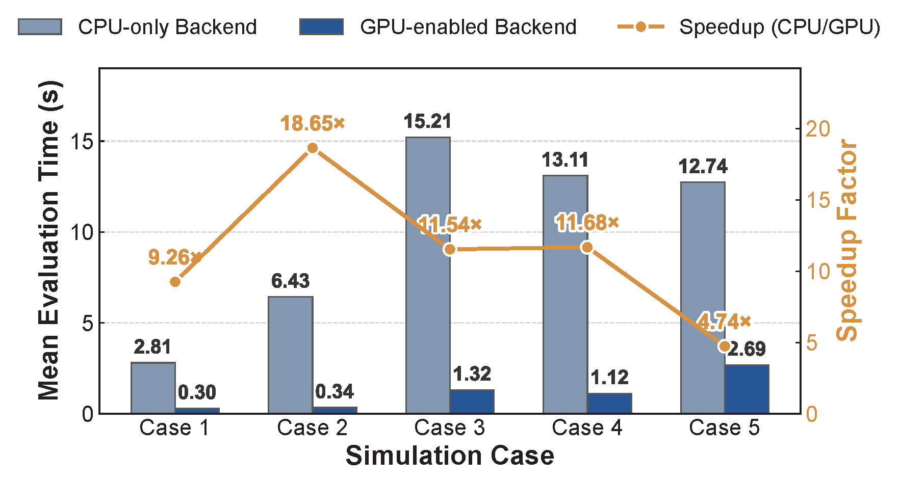
  <div class="figure-caption">
    GPU 与 CPU 后端基准测试，展示五个案例中的平均批量评估时间与加速比。
  </div>
</div>

<div class="figure-box figure-wide">
  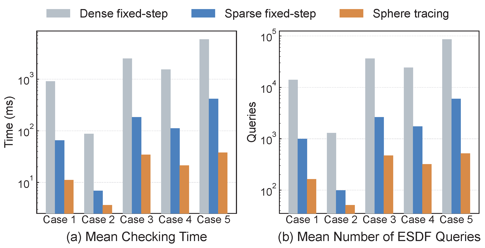
  <div class="figure-caption">
    稠密固定步长采样、稀疏固定步长采样与基于 ESDF 的 sphere tracing 在检测时间和 ESDF 查询次数方面的对比。
  </div>
</div>

### 可视化结果说明

上方视频展示了最终规划航路的动态效果。其中，**二维视频**展示海洋流场背景下的水平航路演化过程，**三维视频**展示相对于海底地形重构得到的下潜—上浮轨迹。二者共同体现了所提方法的三个核心特性：

1. **洋流感知航路规划：** 航路由时变海洋环境塑造，而不是简单沿几何最短线前进。
2. **地形感知安全性：** 三维轨迹能够避开海底地形障碍，并保持安全裕度。
3. **可执行滑翔机运动：** 规划路径可以重构为重复下潜—上浮剖面，与水下滑翔机的实际运行模式一致。

### 当前状态

本文目前正在 **Ocean Engineering** 审稿中。数据和代码可在合理请求下提供。

### BibTeX 引用

如果本工作对您有所帮助，欢迎引用：

```Latex
@article{li2024collision,
      title={Collision-Free Time-Optimal Planning of Underwater Gliders in Time-Varying Currents via Adaptive Niching Dual-Archive Differential Evolution}, 
      author={Li, Zezhong and Juan, Rongshun and Li, Yang and Liu, Shoufu and Wang, Tianshu and Shi, Shuaikun and Du, Leihao and Feng, Wanjun and Gao, Zhongke},
      journal={Under Review at Ocean Engineering},
      year={2026}
}
```

